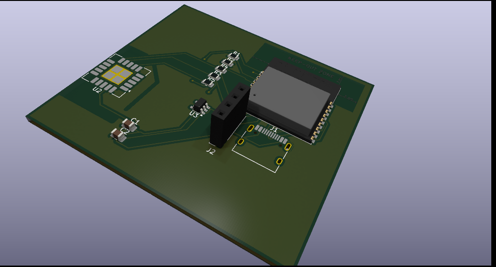

# Stardance CO2 & Environmental Monitor

A custom-designed, compact environmental monitoring board powered by the **ESP32-C3** microcontroller. This project features a high-precision **Sensirion SCD40** sensor to track CO2 levels, temperature, and relative humidity. Designed as part of the Hack Club Stardance hardware challenge.

---

## 🚀 Features

* **Brainpower:** Powered by the RISC-V ESP32-C3-WROOM-02 module supporting Wi-Fi and Bluetooth LE.
* **Precision Sensing:** Integrated Sensirion SCD40 for true photoacoustic $CO_2$ readings, ambient temperature, and humidity.
* **Thermal Isolation:** Features a dedicated physical PCB milling slot (isolation rout) to separate the sensor from the ESP32's operational heat, ensuring highly accurate temperature readings.
* **Display Output:** Dedicated I2C header pins to plug in a standard 0.96" SSD1306 OLED display.
* **Modern Interface:** USB-C connection for reliable power supply and easy flashing/debugging.
* **Hand-Solder Friendly:** Passive components use the 0805 SMD footprint, making it perfectly optimized for easy manual assembly.

---

## 🛠️ Hardware Architecture

### Key Components
* **MCU:** ESP32-C3-WROOM-02
* **Sensor:** Sensirion SCD40-D-R2 (LGA-20)
* **Power Regulator:** AP2112K-3.3V LDO (SOT-23-5)
* **Connector:** 16-pin USB-C (HRO TYPE-C-31-M-12)

### Pin Mapping
* **I2C SDA:** GPIO 8
* **I2C SCL:** GPIO 9
* **USB D-:** GPIO 18
* **USB D+:** GPIO 19

---

## 📁 Repository Structure

* `/hardware` - Contains the KiCad project files, schematics, and PCB layouts.
* `/gerbers` - Production-ready Gerber and Drill files (`.zip` format) for manufacturing.
* `BOM.md` - Complete Bill of Materials with exact hardware designators and component values.

---

## 🔧 Production & Assembly Notes

1. **PCB Fabrication:** The Gerber files are optimized for standard 2-layer manufacturing (1.6mm thickness recommended). Ensure your manufacturer supports internal cutouts/slots for the thermal isolation barrier.
2. **RF Performance:** The top edge of the PCB keeps a strict copper-free clearance zone around the ESP32 onboard antenna to guarantee optimal Wi-Fi and Bluetooth signal strength.
3. **Soldering the SCD40:** Because the SCD40 is an LGA package with pads located entirely underneath the chip, utilizing solder paste and a hot-air rework station (or a reflow heat plate) is highly recommended for assembly.
